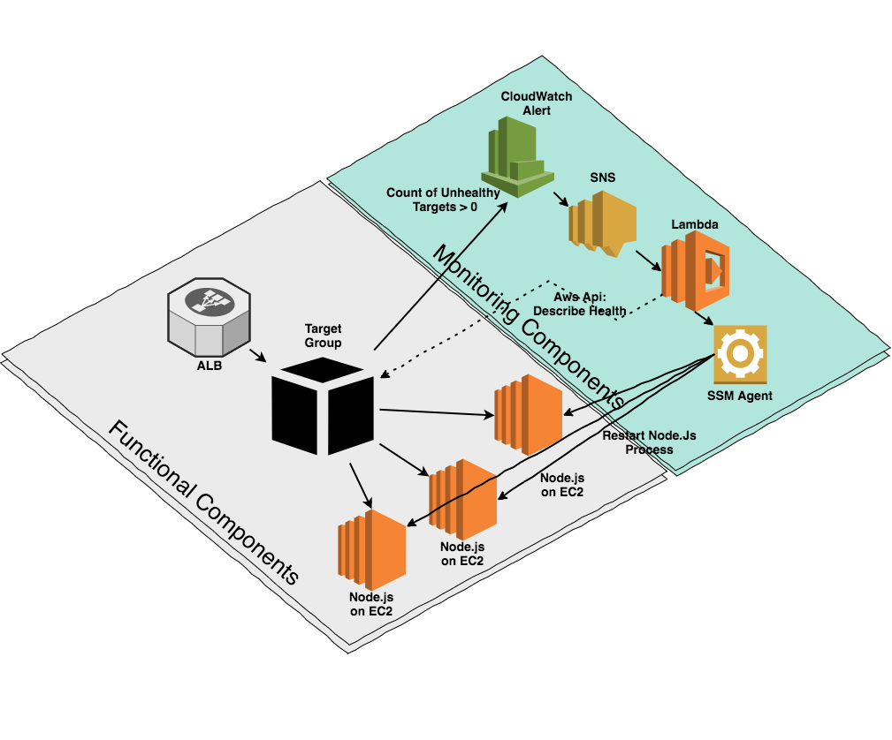
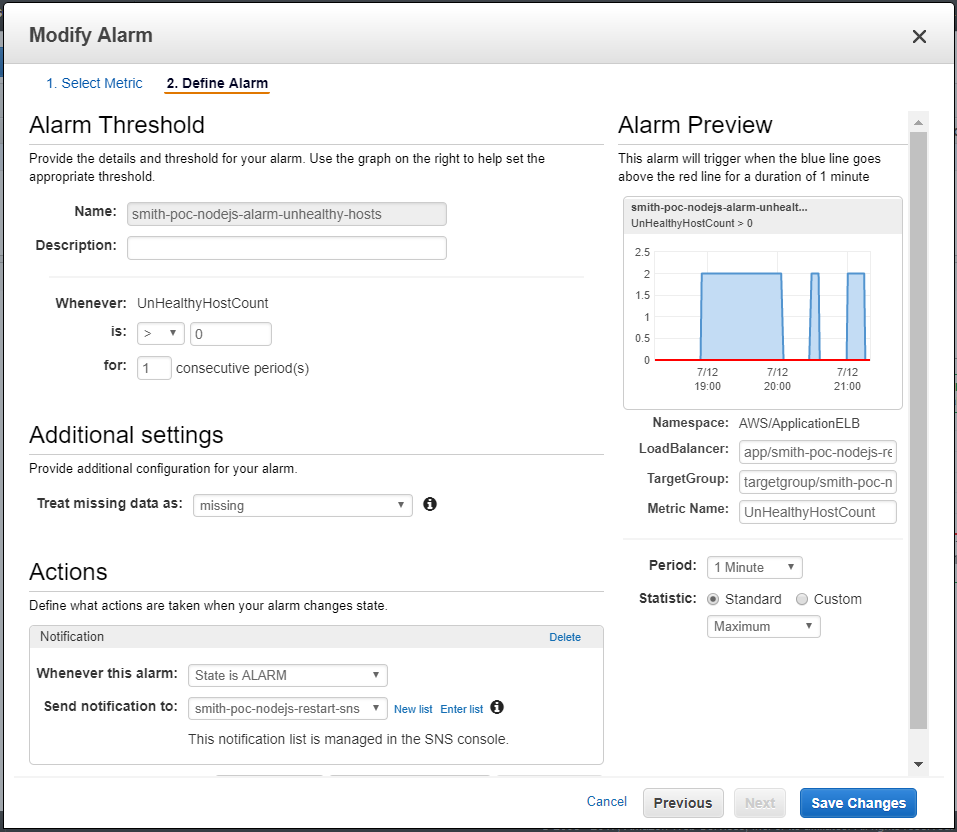

# Alb Recovery #

## Flow ##



* CloudWatch configured to send SNS notification when unhealthy hosts count > 0:

* Important to set **Statistic** to ```Maximum``` rather than to ```Average```
* SNS Notification is sent to Lambda by configuring Lambda Trigger 
* SNS Content received by Lambda in event parameter:
```
{
  "Records": [
    {
      "EventVersion": "1.0", 
      "EventSubscriptionArn": "arn:aws:sns:us-east-2:811322200214:smith-poc-nodejs-restart-sns:e1486bef-ffff-4e26-a235-5dcaf26ab50b", 
      "EventSource": "aws:sns", 
      "Sns": {
        "SignatureVersion": "1", 
        "Timestamp": "2017-07-02T17:36:38.958Z", 
        "Signature": "OSaPIUBPKMGKdP4dqnmuGZ4GF/q4/WKbv2WbpW7mqhlCjBrKtqtY+C8jV2IX5FXmGEAjeMp0H4kwE79e9fUL9+axmnZHxA/8SJjDURNvs4f8MEbeoOXv4TRnI8ibBZQjUcWlG2+xFaw3N+J4OaJKtmCj8w5l4LdLJJKrrkGptmEwuAxzqHSk7EVd4iwQrNaoDsy6iWCv7jqv6JkWbXBB70KTbTcmhQX2rIdiIPUwLAkigq/qVkc3z1t2wIGaI8uOa6OOCzmJ6RrrJVZdyPividO7DUhT5MidQ/bzFsC3uKYltffnJUpWhuE/Cm2XX4sV+3cDJTueZtF2eATupX4tTg==", 
        "SigningCertUrl": "https://sns.us-east-2.amazonaws.com/SimpleNotificationService-b95095beb82e8f6a046b3aafc7f4149a.pem", 
        "MessageId": "30b6e3dc-eedd-5a08-be1b-b20fdfbb831b", 
        "Message": "{\"AlarmName\":\"awsapplicationelb-smith-poc-nodejs-restart-tg-High-Unhealthy-Hosts\",\"AlarmDescription\":\"Created from EC2 Console\",\"AWSAccountId\":\"811322200214\",\"NewStateValue\":\"ALARM\",\"NewStateReason\":\"Threshold Crossed: 1 datapoint (1.0) was greater than the threshold (0.0).\",\"StateChangeTime\":\"2017-07-02T17:36:38.838+0000\",\"Region\":\"US-East-2\",\"OldStateValue\":\"INSUFFICIENT_DATA\",\"Trigger\":{\"MetricName\":\"UnHealthyHostCount\",\"Namespace\":\"AWS/ApplicationELB\",\"StatisticType\":\"Statistic\",\"Statistic\":\"AVERAGE\",\"Unit\":null,\"Dimensions\":[{\"name\":\"LoadBalancer\",\"value\":\"app/smith-poc-nodejs-restart-alb/8aea219e2c2c6eb3\"},{\"name\":\"TargetGroup\",\"value\":\"targetgroup/smith-poc-nodejs-restart-tg/7c25fe0e5ca71022\"}],\"Period\":60,\"EvaluationPeriods\":1,\"ComparisonOperator\":\"GreaterThanThreshold\",\"Threshold\":0.0,\"TreatMissingData\":\"\",\"EvaluateLowSampleCountPercentile\":\"\"}}", 
        "MessageAttributes": {}, 
        "Type": "Notification", 
        "UnsubscribeUrl": "https://sns.us-east-2.amazonaws.com/?Action=Unsubscribe&SubscriptionArn=arn:aws:sns:us-east-2:811322200214:smith-poc-nodejs-restart-sns:e1486bef-ffff-4e26-a235-5dcaf26ab50b", 
        "TopicArn": "arn:aws:sns:us-east-2:811322200214:smith-poc-nodejs-restart-sns", 
        "Subject": "ALARM: \"awsapplicationelb-smith-poc-nodejs-restart-tg-High-Unhealthy-Hosts\" in US-East-2"
	  }
    }
  ]
}
```
* SNS Message Content:
```
{  
  "AlarmName":"awsapplicationelb-smith-poc-nodejs-restart-tg-High-Unhealthy-Hosts",
  "AlarmDescription":"Created from EC2 Console",
  "AWSAccountId":"811322200214",
  "NewStateValue":"ALARM",
  "NewStateReason":"Threshold Crossed: 1 datapoint (1.0) was greater than the threshold (0.0).",
  "StateChangeTime":"2017-07-02T17:36:38.838+0000",
  "Region":"US-East-2",
  "OldStateValue":"INSUFFICIENT_DATA",
  "Trigger":{  
    "MetricName":"UnHealthyHostCount",
    "Namespace":"AWS/ApplicationELB",
    "StatisticType":"Statistic",
    "Statistic":"AVERAGE",
    "Unit":null,
    "Dimensions":[  
      {  
        "name":"LoadBalancer",
        "value":"app/smith-poc-nodejs-restart-alb/8aea219e2c2c6eb3"
      },
      {  
        "name":"TargetGroup",
        "value":"targetgroup/smith-poc-nodejs-restart-tg/7c25fe0e5ca71022"
      }
    ],
    "Period":60,
    "EvaluationPeriods":1,
    "ComparisonOperator":"GreaterThanThreshold",
    "Threshold":0.0,
    "TreatMissingData":"",
    "EvaluateLowSampleCountPercentile":""
  }
}
```
* For each target group in dimension extract target groupArn suffix to build full arn:
'arn:aws:elasticloadbalancing:{AWS_REGION}:{AWS_ACCOUNT_NUMBER}:{arnSuffix}'
* Call Aws Api to collect targets health for each target group as ```describe_target_health``` does not accept multiple group arns
* Payload returned:
```
[  
  {  
    "HealthCheckPort":"3000",
    "Target":{  
      "Id":"i-019ebfaf92631c228",
      "Port":3000
    },
    "TargetHealth":{  
      "State":"unhealthy",
      "Reason":"Target.ResponseCodeMismatch",
      "Description":"Health checks failed with these codes: [500]"
    }
  },
  {  
    "Target":{  
      "Id":"i-0b314f9c31a99621c",
      "Port":3000
    },
    "TargetHealth":{  
      "State":"unused",
      "Reason":"Target.InvalidState",
      "Description":"Target is in the stopped state"
    }
  }
]


```
* Collect unhealthy/unused targets, possible target states: ```'initial'|'healthy'|'unhealthy'|'unused'|'draining'```
* Assemble list of unhealthy target groups with their targets:
```
[  
  {  
    "UnhealthyTargets":[  
      {  
        "HealthCheckPort":"3000",
        "Target":{  
          "Id":"i-019ebfaf92631c228",
          "Port":3000
        },
        "TargetHealth":{  
          "State":"unhealthy",
          "Reason":"Target.ResponseCodeMismatch",
          "Description":"Health checks failed with these codes: [500]"
        }
      },
      {  
        "Target":{  
          "Id":"i-0b314f9c31a99621c",
          "Port":3000
        },
        "TargetHealth":{  
          "State":"unused",
          "Reason":"Target.InvalidState",
          "Description":"Target is in the stopped state"
        }
      }
    ],
    "name":"TargetGroup",
    "value":"targetgroup/smith-poc-nodejs-restart-tg/7c25fe0e5ca71022"
  }
]
```
* Using payload assembled from previous steps recycle execute send-command to each instance to restart service
* [SSM Role for EC2 Instances](http://docs.aws.amazon.com/systems-manager/latest/userguide/sysman-configuring-access-policies.html)
* EC2 Instances Role must include: AmazonEC2RoleforSSM policy
* Lambda Exceution Role must include:  AmazonEC2FullAccess, CloudWatchLogsFullAccess, CloudWatchLogsForLambda, AmazonSSMFullAccess, CloudWatchEventsFullAccess policies
* [Installing SSM Agent](http://docs.aws.amazon.com/systems-manager/latest/userguide/ssm-agent.html#sysman-install-ssm-agent)
* To validate configuration run:
```
aws ssm describe-instance-information
```
* Ouput will list instances with SSM agent installed and IAM Roles configured:
```
cabox@box-codeanywhere:~/workspace$ aws ssm describe-instance-information
	{
		"InstanceInformationList": [
			{
				"IsLatestVersion": true,
				"ComputerName": "ip-172-31-32-142.us-east-2.compute.internal",
				"PingStatus": "Online",
				"InstanceId": "i-0b314f9c31a99621c",
				"IPAddress": "172.31.32.142",
				"ResourceType": "EC2Instance",
				"AgentVersion": "2.0.847.0",
				"PlatformVersion": "7.2",
				"PlatformName": "Red Hat Enterprise Linux Server",
				"PlatformType": "Linux",
				"LastPingDateTime": 1499986973.929
			}
		]
	} 
```
* [Send Command walkthrough](http://docs.aws.amazon.com/systems-manager/latest/userguide/walkthrough-cli.html)
* [Disable require tty](https://www.shell-tips.com/2014/09/08/sudo-sorry-you-must-have-a-tty-to-run-sudo/)
* Test command:
```
aws ssm send-command --instance-ids "i-0b314f9c31a99621c" --document-name "AWS-RunShellScript" \
--comment "IP config" --parameters "commands=ifconfig" --output text

aws ec2 get-console-output --instance-id "i-0b314f9c31a99621c"
```
* Add 'service-name' tag to target group to identify what service to restart on ec2 instance(s) using:
```
sudo service service-name restart
```
