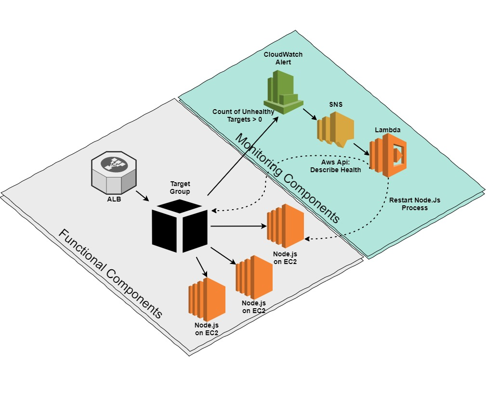

# Alb Recovery #

## Flow ##

* CloudWatch configured to send SNS notification when unhealthy targets count > 0
* SNS Notification is sent to Lambda
* SNS Content:
```
-
```
* SNS Message Content:
```
{  
  "AlarmName":"awsapplicationelb-smith-poc-nodejs-restart-tg-High-Unhealthy-Hosts",
  "AlarmDescription":"Created from EC2 Console",
  "AWSAccountId":"811322200214",
  "NewStateValue":"ALARM",
  "NewStateReason":"Threshold Crossed: 1 datapoint (1.0) was greater than the threshold (0.0).",
  "StateChangeTime":"2017-07-02T17:36:38.838+0000",
  "Region":"US-East-2",
  "OldStateValue":"INSUFFICIENT_DATA",
  "Trigger":{  
    "MetricName":"UnHealthyHostCount",
    "Namespace":"AWS/ApplicationELB",
    "StatisticType":"Statistic",
    "Statistic":"AVERAGE",
    "Unit":null,
    "Dimensions":[  
      {  
        "name":"LoadBalancer",
        "value":"app/smith-poc-nodejs-restart-alb/8aea219e2c2c6eb3"
      },
      {  
        "name":"TargetGroup",
        "value":"targetgroup/smith-poc-nodejs-restart-tg/7c25fe0e5ca71022"
      }
    ],
    "Period":60,
    "EvaluationPeriods":1,
    "ComparisonOperator":"GreaterThanThreshold",
    "Threshold":0.0,
    "TreatMissingData":"",
    "EvaluateLowSampleCountPercentile":""
  }
}
```
* For each target group in dimension extract target groupArn suffix to build full arn:
'arn:aws:elasticloadbalancing:{AWS_REGION}:{AWS_ACCOUNT_NUMBER}:{arnSuffix}'
* Call Aws Api to collect targets health for each target group as ```describe_target_health``` does not accept multiple group arns
* Payload returned:
```
[  
  {  
    "HealthCheckPort":"3000",
    "Target":{  
      "Id":"i-019ebfaf92631c228",
      "Port":3000
    },
    "TargetHealth":{  
      "State":"unhealthy",
      "Reason":"Target.ResponseCodeMismatch",
      "Description":"Health checks failed with these codes: [500]"
    }
  },
  {  
    "Target":{  
      "Id":"i-0b314f9c31a99621c",
      "Port":3000
    },
    "TargetHealth":{  
      "State":"unused",
      "Reason":"Target.InvalidState",
      "Description":"Target is in the stopped state"
    }
  }
]


```
* Collect unhealthy/unused targets
* Possible target states:
```
'State': 'initial'|'healthy'|'unhealthy'|'unused'|'draining'
```
* Assemble list of unhealthy target groups with their targets:
```
[  
  {  
    "UnhealthyTargets":[  
      {  
        "HealthCheckPort":"3000",
        "Target":{  
          "Id":"i-019ebfaf92631c228",
          "Port":3000
        },
        "TargetHealth":{  
          "State":"unhealthy",
          "Reason":"Target.ResponseCodeMismatch",
          "Description":"Health checks failed with these codes: [500]"
        }
      },
      {  
        "Target":{  
          "Id":"i-0b314f9c31a99621c",
          "Port":3000
        },
        "TargetHealth":{  
          "State":"unused",
          "Reason":"Target.InvalidState",
          "Description":"Target is in the stopped state"
        }
      }
    ],
    "name":"TargetGroup",
    "value":"targetgroup/smith-poc-nodejs-restart-tg/7c25fe0e5ca71022"
  }
]
```
* Now is what to do about every unhealthy target?